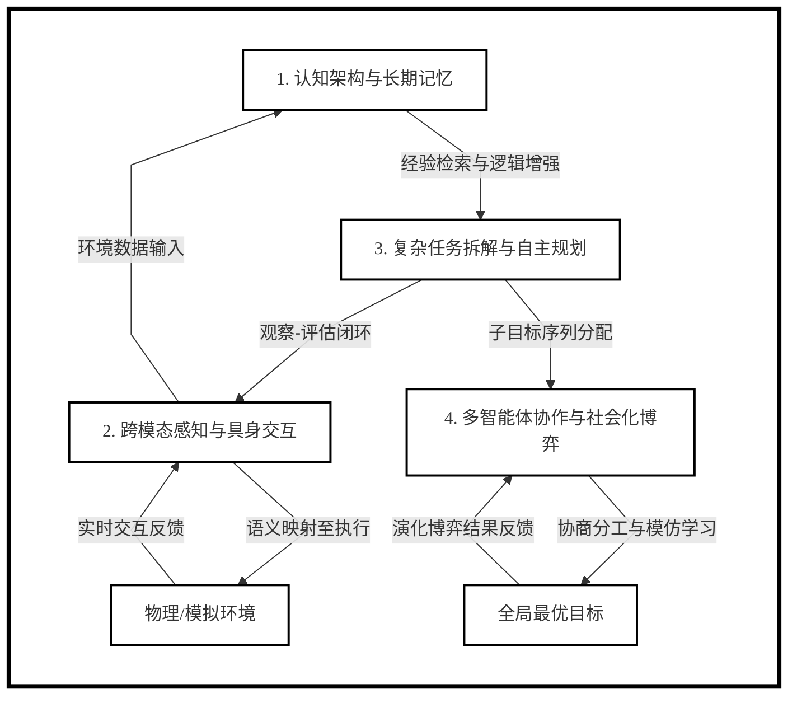

# mermaid-prompt
画出规范的mermaid 的 prompt。

我看了很多其他的仓库，发现它们要么就是自己写了个网页，然后用很复杂的东西去生成一个流程图。要么是写了一些 prompt，但是只是要求根据用户的需求去制作流程图。但是它们都没有指出一些最常见的规范，就是工程制图的规范，就是项目报告书里面常见的一些典例，这些都是没有的。就如果我要自创一个规范模板，然后它们只有流程图，时序图，类图，这种规定就是很草率。所以我就打算直接写一个能够直接复制粘贴到网页 App 中的提示词，模板能用就行，没有必要再额外的自己再重新写一个网页了。

然后这个仓库的文档是我测试了还可以的模板内容，文档标题就是模板的性质。然后可能后面有其他需求会往里面增加吧。但是先这样吧，反正我这个仓库也没人看。

以下测试结果都测试来源于 Gemini flash。

## 技术报告架构框图

输入示例：

```markdown
研究内容：自主智能体协同演进与跨模态决策机制研究
本项研究旨在探索智能体在复杂动态环境中的自主性边界。研究重点在于如何构建具备自我进化能力的架构，使其能够处理从感知到行动的全链路闭环。通过融合长短期记忆网络与多层级推理，提升智能体在不确定性场景下的稳健性，并最终实现多智能体之间的高效协作。
1. 认知架构与长期记忆存储机制
本模块聚焦于构建智能体的“数字大脑”，核心在于解决大语言模型在长程交互中的遗忘问题。研究将通过构建分级存储系统，将瞬时感知存入短期工作空间，而将核心知识与历史经验编码进基于向量数据库的长期记忆。通过这种索引与检索机制，智能体能够根据历史教训优化当前决策，实现类似于人类的持续学习能力，显著提升其在执行复杂、跨周期任务时的逻辑连贯性与情境感知力。
2. 跨模态感知与具身智能交互
研究旨在突破智能体仅限于文本处理的局限，使其具备对物理或模拟环境的感知能力。通过整合计算机视觉、语音识别及传感器数据，智能体能够理解多维度的环境信息。重点攻克“语义映射到动作”的难题，即如何将抽象的指令转化为具体的执行逻辑。这种具身智能的演进，使得智能体不再是闭门造车的程序，而是能够与现实世界进行实时交互、反馈并自我修正的实体，为工业自动化与家庭服务奠定基础。
3. 复杂任务拆解与自主规划策略
针对高阶目标，本研究探索智能体的主动规划逻辑。利用思维链（CoT）与自反思技术，智能体能将模糊的大任务拆解为可操作的子目标序列。在执行过程中，智能体将具备动态评估能力，根据环境变化实时调整预案。研究重点在于构建一种“观察-评估-决策-行动”的循环闭环，降低对人类提示词的依赖。通过引入因果推理模型，减少智能体在复杂逻辑推演中的幻觉问题，使其执行路径更加科学高效。
4. 多智能体协作与社会化演化博弈
本点关注多个智能体在共享环境下的协同效率。研究将模拟群体智能，探索在有限通信带宽与资源竞争条件下，智能体如何通过协商与分工达成全局最优解。通过引入博弈论模型，分析智能体在合作与竞争中的行为演变，构建一种可扩展的通信协议。这不仅提升了系统整体的鲁棒性，还允许智能体通过观察同伴行为进行模仿学习，最终形成一套具备社会化特征的自组织体系，以应对单体无法胜任的大规模任务挑战。
```

效果示例：

